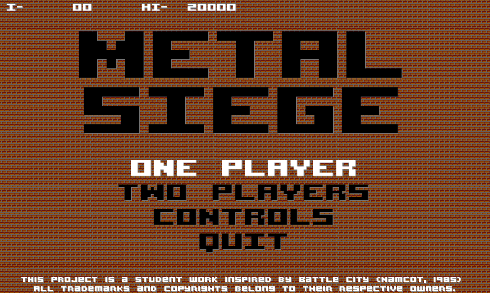
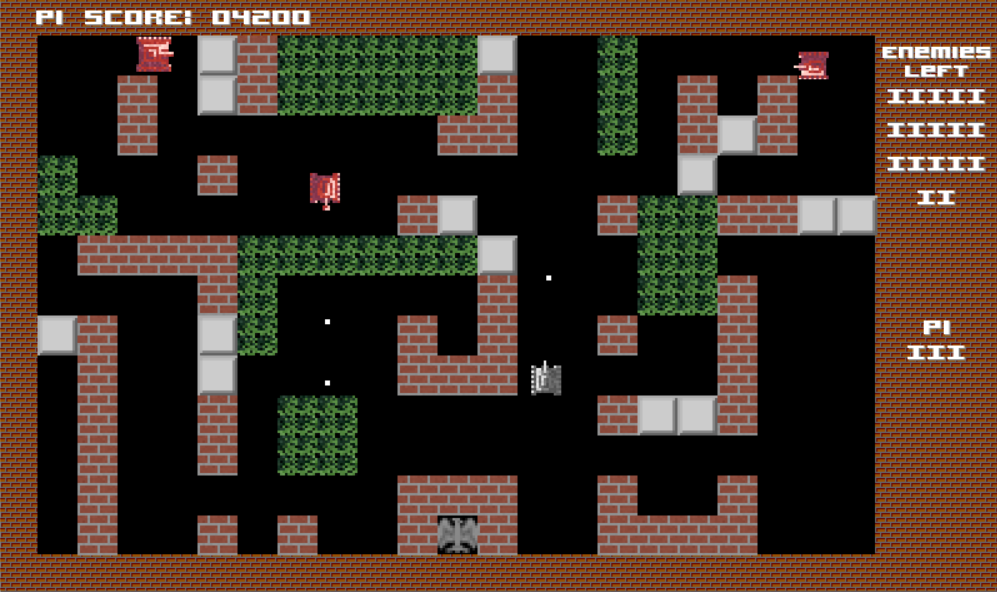
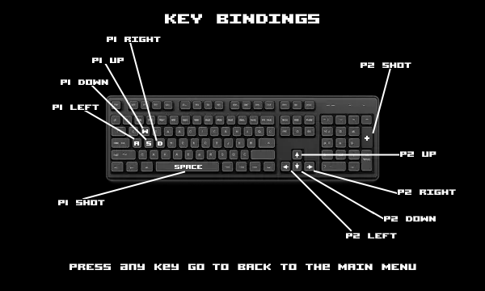
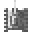
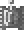
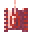

# Metal Siege (Pygame) 🚀🛡️

---

## 🙏 Credits & Inspiration
Metal Siege is a student-made, non-commercial remake inspired
by Battle City (Namcot, 1985). This project was developed as
part of my learning journey in Python, Pygame, and game architecture,
exploring entity systems, collision logic, sprite management,
and retro game design.

All code, structure, and assets were implemented, step by
step, using the original sprites as a base and created edited ones
specifically for this project, resulting in a visually distinct homage
to the classic tank game.

## 🎮 Main Menu

Metal Siege is a retro tank‑battle game where you control a gray tank
(Player 1 or Player 2) and fight waves of red enemy tanks across
destructible battlefields. Protect your Eagle Base, survive enemy waves,
and clear stages in classic arcade fashion.

## 🔥 Game Modes
- 1 Player — Solo tank action.
- 2 Players Competitive — Team up to defend the base together, but don't
shoot each other.

🧱 Gameplay Overview
Metal Siege recreates the iconic Battle City mechanics:

 - Gray Tanks → Player 1 and Player 2
 - Red Tanks → Enemy Types 1, 2, and 3
 - Brick Walls → Destructible
 - Steel Walls → Indestructible
 - Bushes → Visual cover
 - Water → Movement blocker
 - Eagle Base → Protect it at all costs

## 🕹️ Gameplay Screenshot

## 🎹 Controls

### Player 1
- Move Up:	    W
- Move Down:	S
- Move Left:	A
- Right:	    D
- Shoot:	    Space

### Player 2
- Move Up:		↑ (Arrow Up)
- Move Down:		↓ (Arrow Down)
- Move Left:		← (Arrow Left)
- Right:		    → (Arrow Right)
- Shoot:	        Keypad +

💡 Controls can be customized in Const.py.

## 🧩 Main Entities
### 🛡️ Player Tanks

- Player 1
  
  ----

- Player 2

  ----

### 🔥 Enemy Tanks
- Enemy Type 1

  ----

- Enemy Type 2

  ----

- Enemy Type 3

  ----

## 🚀 How to play
Just run the MetalSiegeGame.exe located in the root directory.

## 🏫 Project Context

Metal Siege was developed as part of my game development studies, exploring:
- Object-oriented programming
- Collision detection
- Sprite animation
- Game loop architecture
- Level design
- Asset management

It serves as a portfolio piece demonstrating clean structure, modularity, and retro game recreation.

---

# ⚠️ Disclaimer
Metal Siege is a fan-made, educational project inspired by Battle City (Namcot, 1985).
This work is not affiliated with, endorsed by, or sponsored by Namco, Bandai Namco, or any rights holders.
All trademarks and original game concepts belong to their respective owners.
This project is distributed strictly for learning, research, and portfolio demonstration purposes, with no commercial intent.

---

### ❤️ Made With
💻 Python
🎮 Pygame
🎨 Custom pixel art
🔥 Passion for retro games

by pgmatheus-code